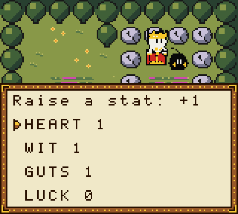
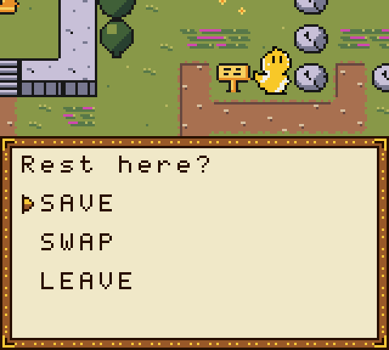

# Boo Kingdom: game guide

This guide explains how the game works. It has no story spoilers.

## Controls

| Button | On the map | In menus and text |
|---|---|---|
| D-pad | Walk | Move the cursor |
| A | Talk, read, look | Confirm, next page, stop the dice |
| B | Hold to run | Back, or show the whole page at once |
| START | Open the pause sheet | Close it |

On the title screen, pick `CONTINUE` to load your save or `NEW GAME` to start over.

## The loop

1. **Explore.** Walk the land and talk to everyone. Signs and chests are worth reading.
2. **Find a stuck Boo.** Every Boo has a flaw, and right now it's causing trouble.
3. **Win its trust.** Some Boos join after a trust battle. Others give you a quest.
4. **Use its flaw.** A flaw is also a power. Boos in your party open paths you couldn't take before.
5. **Bring it home.** Give each Boo a job at the Glade, and the Glade grows back.

## Your party

- The King walks with up to 2 Boos. The others wait at the Glade camp.
- Swap your party at the **Glade campfire** (`SWAP`).
- Who you bring matters: in fights, in dice checks, and for which paths you can open.

## The King's stats

| Stat | Helps with |
|---|---|
| HEART | Kindness, calming Boos down, trust |
| WIT | Puzzles, locks, spotting lies and traps |
| GUTS | Pushing, climbing, standing your ground |
| LUCK | Added to every roll |

Each Boo you bring home gives back a piece of the King's essence. Each piece is +1 to a stat you pick.

## Dice checks

- Some actions ask for a check, like `GUTS vs 18`. Press A to stop the spinning d20. Your stat is added to the roll.
- Meet or beat the number and you succeed. Fail and something (usually funny) happens, and you can look for another way.
- A **20** is a critical hit. A **1** is a fumble.
- **Advantage** means you roll 2 dice and keep the higher one.
- Some rolls happen in secret, like a real game master rolling behind the screen.

## Battles

| Command | What it does |
|---|---|
| FIGHT | Attack. Roll to hit, then roll damage. |
| FLAW | A big, risky move. It fills that Boo's flaw meter. |
| TALK | Cheer an ally: they get advantage and their flaw meter calms down. |
| ITEM | Use Bread or other items. |
| RUN | Try to escape. Only works against corruption you met on the map. |

- The line above the menu tells you what the highlighted move does.
- **Weak spots** take double damage. **Resisted** hits do half. Try different Boos against different enemies.
- **Flaw meters** fill as a Boo uses its flaw. When a meter is full, the flaw goes off on its own. Sometimes that's great. Sometimes it's a disaster.
- Your damage die grows over the game: d4, d6, d8 and beyond.

## Trust battles

- You never hit the stuck Boo. You calm it down while the corruption attacks you both.
- Fill the **trust** bar with the right words (TALK), kind actions, and by clearing the corruption around it.
- If you pick the wrong words, it's funny, not fatal. If you lose, you can try again.

## Corruption on the map

- Enemies walk around where you can see them. Touch one and a fight starts.
- You can walk around most of them.
- A beaten enemy is gone for good. You don't need to grind.

## Campfires and saving

- Talk to a campfire: `SAVE` saves your game and heals your whole party.
- The game saves to the cartridge's battery memory. It lasts through power off.
- If your party is knocked out, you wake at the last campfire with half your bits.
- Finishing the game saves too. `CONTINUE` then takes you back to a finished kingdom.

## Bits and items

- **Bits** are money. You find them in chests and win them in fights.
- **Bread** heals. Keep some for long trips.

## The pause sheet

Press START to see the King's HP, stats, essence, damage die, your party, your play time, and your items.

## Tips

- Talk to Boos more than once. They remember what you did.
- Kind, bossy and silly choices all count. The Boos greet you differently depending on how you lead.
- Stuck? Go back to the Glade and ask around.
- If a fight feels impossible, you might have the wrong Boos with you.
