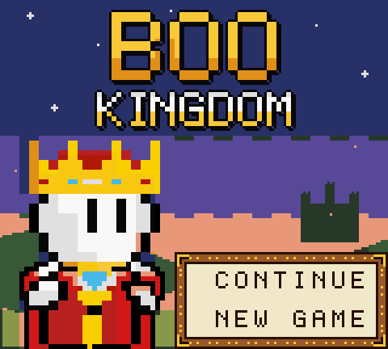
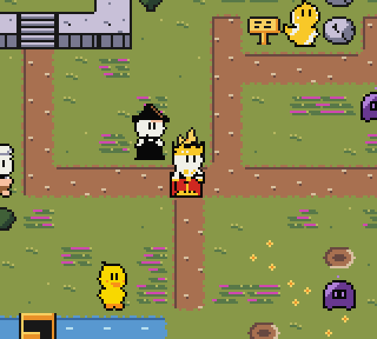
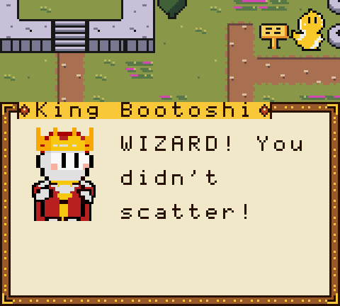
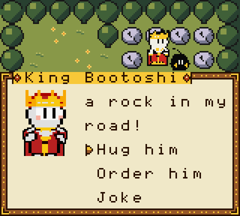
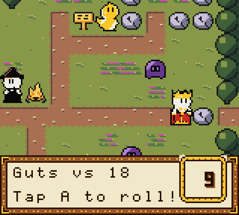
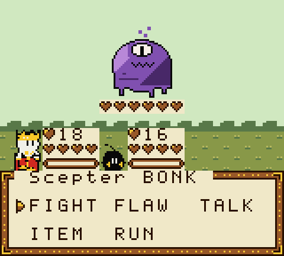
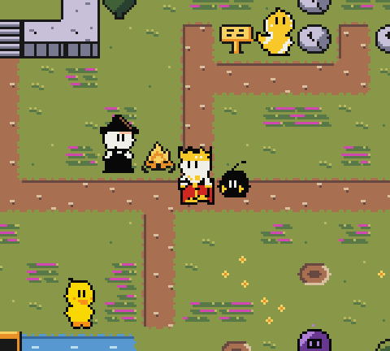
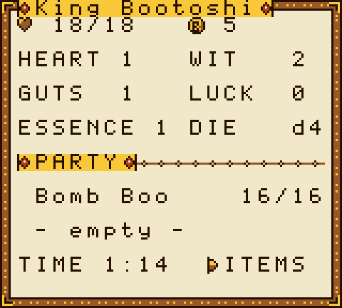

# Boo Kingdom

A Game Boy Color RPG. You are King Bootoshi, and your kingdom just split apart.

Something corrupted block 775087. To save everyone, the King broke his own essence into pieces, and the Boos scattered across the land. He wakes up weak, alone, and very sure he can fix it all by himself.

He can't. That's the game.

 

## Download

Get `boo-kingdom.gbc` from the [latest release](../../releases/latest).

- Game Boy Color only (it won't run on the original grey Game Boy)
- 512 KB ROM, MBC5 with 32 KB battery save
- About 30 to 45 minutes to finish, depending on your choices

## What's inside

- **Befriend Boos, don't catch them.** 8 Boos to bring home, each with a flaw that causes trouble and is also their power.
- **Dice for everything.** A d20 spins on screen and you stop it with A. Fights, locks, climbs, lies and jokes all roll.
- **Choices the world remembers.** Be kind, bossy or silly. The Boos notice, and they talk about it.
- **Turn-based battles** with weak spots, crits, fumbles, and flaw meters that go off when you least want them to.
- **Trust battles.** Some Boos you can't fight. You calm them down while the corruption attacks you both.
- **A home that grows.** Give each Boo a job at the Glade and watch it rebuild.
- **Talking portraits** with blinking eyes and moving mouths.
- **An original chiptune soundtrack.** 9 songs, all 4 Game Boy sound channels.
- **Campfire saves** into the cartridge's battery memory.

 
 
 

## How to play

**On a computer.** Open the ROM in a Game Boy Color emulator:

- [SameBoy](https://sameboy.github.io) (macOS, Windows, Linux). On macOS: `brew install --cask sameboy`
- [mGBA](https://mgba.io) (macOS, Windows, Linux)
- [Emulicious](https://emulicious.net) (Windows, macOS, Linux; needs Java)

**On a real Game Boy Color.** Copy the ROM to a flash cartridge, like an EverDrive GB X7, or write it to an MBC5 cart with battery save. It also runs on the ModRetro Chromatic.

New to the game? Read the [game guide](GUIDE.md). It has no story spoilers.

## Credits

Made by **Bootoshi** ([@kingbootoshi](https://x.com/kingbootoshi)). Boo characters and art by Bootoshi.

Built with [GBDK-2020](https://github.com/gbdk-2020/gbdk-2020).

## License

Copyright Bootoshi. All rights reserved.
